# Graphviz使用总结

---

**这东西真是贼JB好用**

---

## 安装

### Windows安装
[官网](http://www.graphviz.org/)

选Stable 2.38 Windows install packages

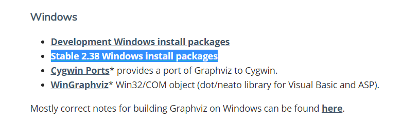

选择Zip格式

解压后需要添加Path路径（以Win10为例）

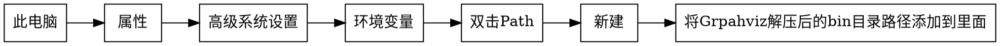

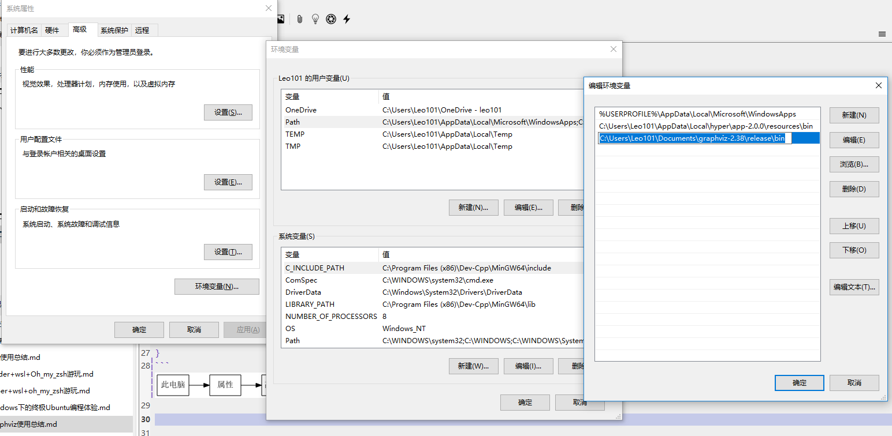

---

### Ubuntu安装

Ubuntu可以直接用apt-get安装：

```
sudo apt-get install graphviz
```

---

### 测试是否安装成功

在终端或cmd中输入

```
dot -version
```

显示如下结果表示安装成功（卡在那里没关系，强制退出即可）

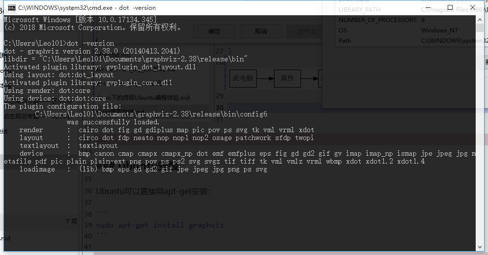

---

## 使用

### 最简单的画图

有向图：

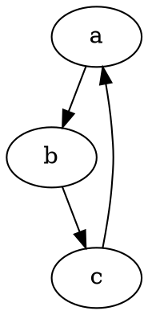

无向图：

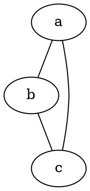

其中G为图的名称，可以随便取

### 稍微NB一点的小操作（以无向图为例，有向图同理）

一次添加多个边：

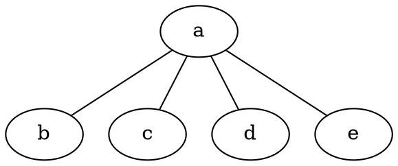

修改边和点的颜色：

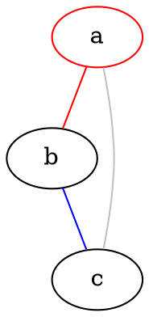

修改点的排列顺序：

原来

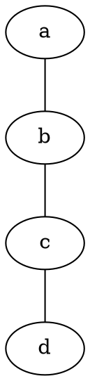

现在

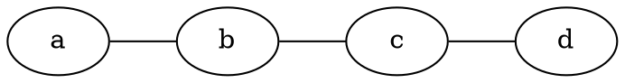

添加边的名字（可以当边权来用）

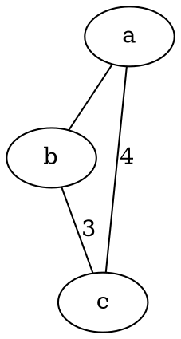

对所有边执行操作

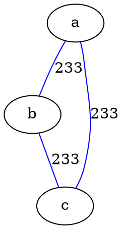

修改点的形状

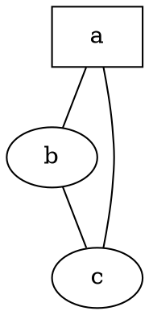

对所有点执行操作：

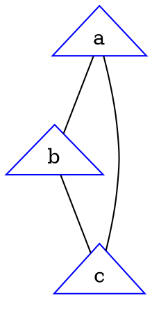

批量操作

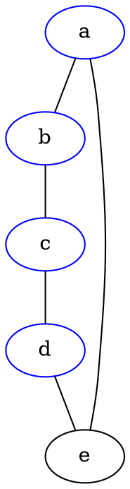

修改出边的方向

支持`w, e, s, n, sw, se, nw, ne`

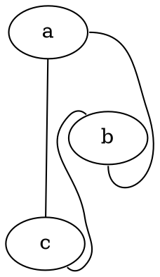

修改对点的描述（感觉没用）

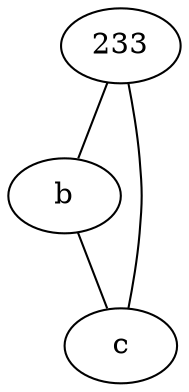

一个类似结构体的东西

需要将点的形状改为`record`，所以只能默认方形

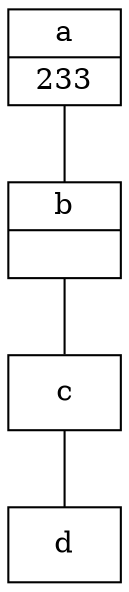