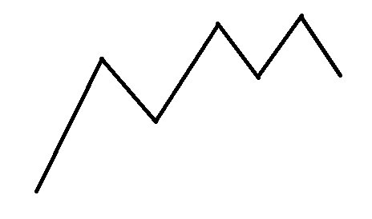

# AT2370 Piling Up

---

## 题面

[Luogu](https://www.luogu.org/problemnew/show/AT2370)
[AtCoder](https://agc013.contest.atcoder.jp/tasks/agc013_d)

---

## 题解

题面有点绕，可以转化一下，就是拿出一个球，然后把它染色，然后放回去

设$Dp[i][j]$表示执行了$i$次操作，有$j$个黑色的球的方案数

转移就非常简单了

$Dp[i][j] +=$ :

- 黑->白 $Dp[i - 1][j - 1]$
- 黑->黑 $Dp[i - 1][j]$
- 白->黑 $Dp[i - 1][j + 1]$
- 白->白 $Dp[i - 1][j]$

然后你会发现Wa了

因为以上四个状态加起来会有很多重复的

把每个状态都映射到一个坐标上（不考虑值），你会发现一种抽球的方案数大概长这样：



反正就是一段折线

你会发现如果这段折线有某个坐标碰到了底部，那么它是唯一的

因为它不能向上移动，否则它就不触底，也不能向下移动，否则它就不合法~~，更不能向左和右移动~~

这样一来，就只会有一个$Dp$可以表示这个折线

那么我们可以考虑把别的折线也平移下来，只算触了底的$Dp$值

然后你就会发现这是道看起来很傻逼但真的很神仙的题

---

### 一个优秀的实现方法

按照常规的来说，我们需要加一维来表示是否触底

但是这里有一个更加优秀的实现方法

我们进行两次二维Dp，第一次是正常的，第二次将$n--$，这样可以保证它一定不会触底

然后把两次的答案减一下，所有情况-不触底情况=触底情况

---

## 代码

```c++
/**************************
  * Writer : Leo101
  * Problem : Luogu AT2370 Piling Up
  * Tags : Dp
**************************/
#include <iostream>
#include <cstdio>
#include <algorithm>
#include <cstring>
#define File(s) freopen(#s".in", "r", stdin); freopen(#s".out", "w", stdout)
#define gi get_int()
const long long Max_N = 5001, Mod = 1e9 + 7;
int get_int()
{
	int x = 0, y = 1; char ch = getchar();
	while ((ch < '0' || ch > '9') && ch != '-')
		ch = getchar();
	if (ch == '-') y = -1,ch = getchar();
	while (ch <= '9' && ch >= '0') {
		x = x * 10 + ch - '0';
		ch = getchar();
	}
	return x * y;
}

long long Dp[Max_N][Max_N];

long long Get_ans(int n, int m)
{
	memset(Dp, 0, sizeof(Dp));
	for (int i = 0; i <= n; i++) Dp[0][i] = 1;
	for (int i = 1; i <= m; i++) 
		for (int j = 0; j <= n; j++) {
			if (j != 0)
				Dp[i][j] = (Dp[i][j] + Dp[i - 1][j] + Dp[i - 1][j - 1]) % Mod;
			if (j != n)
				Dp[i][j] = (Dp[i][j] + Dp[i - 1][j] + Dp[i - 1][j + 1]) % Mod;
		}
	long long Ans = 0;
	for (int i = 0; i <= n; i++) Ans = (Ans + Dp[m][i]) % Mod;
	return Ans;
}

int main()
{
	File(code);

	int n = gi, m = gi;

	printf("%lld", (Get_ans(n, m) -  Get_ans(n - 1, m) + Mod) % Mod);

	return 0;
}
```