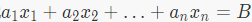
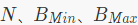
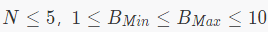
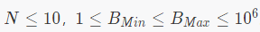
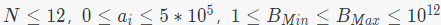

# Luogu2371【国家集训队】墨墨的等式
## 题目
### 题目描述

墨墨突然对等式很感兴趣，他正在研究,存在非负整数解的条件，他要求你编写一个程序，给定N、{an}、以及B的取值范围，求出有多少B可以使等式存在非负整数解。

### 输入输出格式

**输入格式：**  

输入的第一行包含3个正整数，​分别表示数列的长度、B的下界、B的上界。

输入的第二行包含N个整数，即数列{an}的值。

**输出格式：**  

输出一个整数，表示有多少b可以使等式存在非负整数解。

### 输入输出样例

**输入样例#1：**

2 5 10
3 5

**输出样例#1：** 

5

### 说明

对于20%的数据，。

对于40%的数据，。

对于100%的数据，。

---

## 题解

***对我来说这是道神仙题***

这题和Luogu2403跳楼机很像，只不过跳楼机只有x，y，z，而这题有很多个a[i]，考虑只用除了a[0]的其他数加，那么所加出来的数%a[0]，然后再记录一下%之前的数，那么求出每个$0$ ~ $(a[0]-1)$需要加的最小的数，然后统计答案（如何统计参考Luogu3403跳楼机），最后用Bmax统计出来的答案-Bmin统计出来的答案，就是本题的答案了

---

## 代码

* 注意一下这题对我这种数组乱开的人有点卡空间，试了好几次数组的大小才过

```cpp
#include <iostream>
#include <cstdio>
#include <algorithm>
#include <cstring>
#include <queue>
#define File(s) freopen(#s".in", "r", stdin); freopen(#s".out", "w", stdout)
#define gi get_int()
#define _ 4000005
#define for_edge(i, x) for (int i = Head[x]; i != -1; i = Edges[i].Next)
#define INF 0x3f3f3f3f
long long get_int()
{
    long long x = 0, y = 1; char ch = getchar();
    while ((ch < '0' || ch > '9') && ch != '-')
        ch = getchar();
    if (ch == '-') y = -1, ch = getchar();
    while (ch <= '9' && ch >= '0') {
        x = x * 10 + ch - '0';
        ch = getchar();
    }
    return x * y;
}

class Edge
{
    public:
        int Next, To, Value;
}Edges[_];
int Head[_], E_num;
void Add_edge(int From, int To, int Value)
{
    Edges[E_num] = (Edge){Head[From], To, Value};
    Head[From] = E_num++;
}

long long Dist[_], Vis[_], Num[_];

void SPFA()
{
    memset(Dist, 0x3f, sizeof(Dist));
    memset(Vis, 0, sizeof(Vis));
    std::queue<int> Q;
    Q.push(0);
    Dist[0] = 0;
    Vis[0] = true;
    while (!Q.empty()) {
        int Now = Q.front();Q.pop();
        for_edge(i, Now) {
            int To = Edges[i].To, Value = Edges[i].Value;
            if (Dist[To] <= Dist[Now] + Value) continue;
            Dist[To] = Dist[Now] + Value;
            if (Vis[To] == false) {
                Vis[To] = true;
                Q.push(To);
            }
        }
        Vis[Now] = false;
    }
}

int main()
{
    memset(Head, -1, sizeof(Head));
    int n = gi;
    long long Bmin = gi - 1, Bmax = gi, Min = INF;
    for (int i = 0; i < n; i++) {
        Num[i] = gi;
        Min = std::min(Min, Num[i]);
    }
    std::sort(Num, Num + n);
    for (int i = 0; i < Min; i++)
        for (int j = 1; j < n; j++)
            Add_edge(i, (i + Num[j]) % Min, Num[j]);
    SPFA();
    long long Ans = 0;
    for (int i = 0; i < Min; i++) {
        if (Dist[i] <= Bmin) Ans -= (Bmin - Dist[i]) / Min + 1;
        if (Dist[i] <= Bmax) Ans += (Bmax - Dist[i]) / Min + 1;
    }
    printf("%lld", Ans);
    return 0;
}

```

---

*** 嗯，第二篇总结，有进步 ***