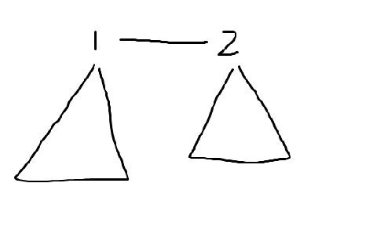

# LOJ10161「一本通 5.2 练习 4」叶子的染色

---

## 题面

[Loj](https://loj.ac/problem/10161)

[Luogu](https://www.luogu.org/problemnew/show/P3155)

---

## 题解

感觉这题有点难想，想了一个十分接近正解的方法，然后就看了题解，原来我那个方法里很多被我默认的东西在题解里还有一大串的证明

首先看到这种题就应该想到树形Dp（而不是因为这道题在树形Dp的专题里面），然后就是推Dp的时候一定好牢记每一个状态都是对之前所有有关的状态的**总结**

设$Dp[i][0/1]$表示当前这一位染黑色（$1$），或白色（$0$）是最少的染色数目

转移为

- $Dp[i][0] = \sum{min(Dp[To][0] - 1, Dp[To][1])}$减一是因为他的儿子和当前节点是同一个颜色那么只要染当前节点就可以了
- $Dp[i][1] = \sum{min(Dp[To][0], Dp[To][1] - 1)}$减一同理

答案为$max(Dp[Root][1], Dp[Root][0])$

然后就是为什么没有考虑不染色的情况，因为从转移方程里就可以看出，当前节点染色一定不会更劣，相当与把儿子的染色全都移到父亲上来了（因为减了1）

然后还有一个问题，就是$Root$是啥，题面中说是无根树，咋一看这题好像不同的根节点求出的答案都不同，但其实稍加证明就可以发现，任意一个非叶子节点都可以当$Root$

证明：

首先可以发现任何一条边都可以将树分成两半，如下（图是蒯的[别人的Blog](https://www.cnblogs.com/neighthorn/p/6188302.html)）



那么显然$1$和$2$谁做$Root$都没有关系，证明：首先$1$和$2$显然不能相等，因为相等还不如把不是根的那个不染色，这一点可以从转移里看出来，那么可以发现$1$和$2$无论哪一个是透明都没有关系，因为答案都是$1$的贡献加$2$的贡献加$1$，然后就是$1$和$2$颜色不同的情况了，发现也可以随便选根，证明同理，那么就可以把根节点按照边移动，都没有关系，所以根节点可以随便选，我选的是$m - 1$

---

## 代码

**注意：代码中的n和m与题面里的是反过来的**

```c++
/**************************
  * Writer : Leo101
  * Problem : LOJ #10161. 「一本通 5.2 练习 4」叶子的颜色
  * Tags : Tree Dp
**************************/
#include <iostream>
#include <cstdio>
#include <algorithm>
#include <cstring>
#define File(s) freopen(#s".in", "r", stdin); freopen(#s".out", "w", stdout)
#define gi get_int()
#define for_edge(i, x) for (int i = Head[x]; i != -1; i = Edges[i].Next)
#define _ 20000
#define INF 0x3f3f3f3f
int get_int()
{
	int x = 0, y = 1; char ch = getchar();
	while ((ch < '0' || ch > '9') && ch != '-')
		ch = getchar();
	if (ch == '-') y = -1,ch = getchar();
	while (ch <= '9' && ch >= '0') {
		x = x * 10 + ch - '0';
		ch = getchar();
	}
	return x * y;
}

class Edge
{
public:
	int Next, To;
}Edges[_];
int Head[_], E_num;
void Add_edge(int From, int To)
{
	Edges[E_num] = (Edge){Head[From], To};
	Head[From] = E_num++;
}

int n, m, Dp[_][2], Color[_];
void Get_ans(int Now, int Pre = -1)
{
	if (Now < m) {
		Dp[Now][Color[Now] ^ 1] = INF;
		Dp[Now][Color[Now]] = 1;
		return ;
	}
	for_edge(i, Now) {
		int To = Edges[i].To;
		if (To == Pre) continue;
		Get_ans(To, Now);
		Dp[Now][0] += std::min(Dp[To][0] - 1, Dp[To][1]);
		Dp[Now][1] += std::min(Dp[To][0], Dp[To][1] - 1);
	}
	Dp[Now][0]++; Dp[Now][1]++;
}

int main()
{
	File(code);

	memset(Head, -1, sizeof(Head));

	n = gi, m = gi;
	for (int i = 0; i < m; i++) Color[i] = gi;
	for (int i = 1; i < n; i++) {
		int From = gi - 1, To = gi - 1;
		Add_edge(From, To);
		Add_edge(To, From);
	}

	Get_ans(n - 1);
	
	printf("%d", std::min(Dp[n - 1][0], Dp[n - 1][1]));

	return 0;
}
```