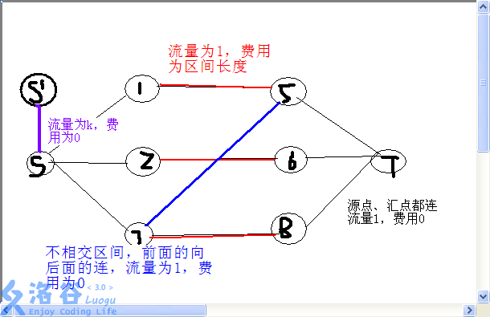
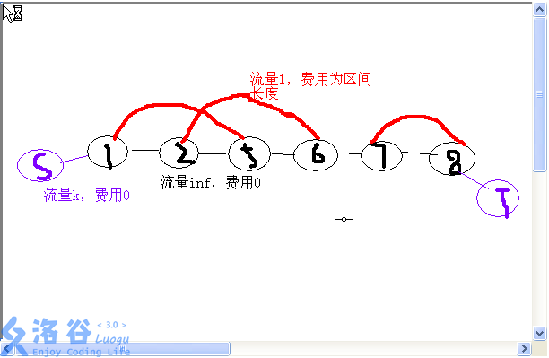

# 「网络流 24 题」最长 k 可重区间集

---

## 题面

[题目链接](https://loj.ac/problem/6014)

---

## 题解

这图讲的是真tm清楚，Orz，两种建图方式：





---

## 代码

```c++
/**************************
  * Writer : Leo101
  * Problem : Luogu P3358 最长k可重区间集问题
  * Tags : 网络流
**************************/
#include <iostream>
#include <cstdio>
#include <algorithm>
#include <cstring>
#include <queue>
#define File(s) freopen(#s".in", "r", stdin); freopen(#s".out", "w", stdout)
#define gi get_int()
#define for_edge(i, x) for (int i = Head[x]; i != -1; i = Edges[i].Next)
#define INF 0x3f3f3f3f
const int Max_N = 50000;
int get_int()
{
	int x = 0, y = 1; char ch = getchar();
	while ((ch < '0' || ch > '9') && ch != '-')
		ch = getchar();
	if (ch == '-') y = -1,ch = getchar();
	while (ch <= '9' && ch >= '0') {
		x = x * 10 + ch - '0';
		ch = getchar();
	}
	return x * y;
}

class Node
{
public:
	int Index, Val;
}Num[Max_N];
bool operator< (const Node& a, const Node& b)
{
	return a.Val < b.Val;
}
int From[Max_N], To[Max_N], Value[Max_N];

class Edge
{
public:
	int Next, To, Value, Cost;
}Edges[Max_N];
int Head[Max_N], E_num;
void Add_edge(int From, int To, int Value, int Cost)
{
	Edges[E_num] = (Edge) {Head[From], To, Value, Cost};
	Head[From] = E_num++;
}

int S, T;

int Answer;
int Cur[Max_N], Dist[Max_N];
bool Vis[Max_N];
bool SPFA()
{
	memset(Vis, 0, sizeof(Vis));
	memset(Dist, -0x3f, sizeof(Dist));
	memcpy(Cur, Head, sizeof(Head));

	std::queue<int> Q;
	Q.push(S); Vis[S] = true;
	Dist[S] = 0;
	
	while (!Q.empty()) {
		int Now = Q.front(); Q.pop();
		for_edge(i, Now) {
			int To = Edges[i].To, Value = Edges[i].Value, Cost = Edges[i].Cost;
			if (Value <= 0 || Dist[To] >= Dist[Now] + Cost) continue;
			Dist[To] = Dist[Now] + Cost;
			if (Vis[To] == false) {
				Vis[To] = true;
				Q.push(To);
			}
		}
		Vis[Now] = false;
	}

	return Dist[T] != Dist[T + 1];
}
int Dfs(int Now, int Min) { if (Now == T) return Min; if (Vis[Now] == true) return 0;
	Vis[Now] = true;
	for (int& i = Cur[Now]; i != -1; i = Edges[i].Next) {
		int To = Edges[i].To, Value = Edges[i].Value, Cost = Edges[i].Cost;
		if (Value <= 0 || Dist[To] != Dist[Now] + Cost) continue;
		int Temp = Dfs(To, std::min(Min, Value));
		if (Temp != 0) {
			Answer += Temp * Cost;
			Edges[i].Value -= Temp;
			Edges[i ^ 1].Value += Temp;
			return Temp;
		}
	}
	return 0;
}
int Dinic()
{
	while (SPFA()) {
		memset(Vis, 0, sizeof(Vis));
		while (Dfs(S, INF) != 0) {
			memset(Vis, 0, sizeof(Vis));
		}
	}
	return Answer;
}

int main()
{
	File(code);

	memset(From, -1, sizeof(From));
	memset(To, -1, sizeof(To));
	memset(Head, -1, sizeof(Head));

	/*Prepare*/
	int n = gi, k = gi, Len = 0;
	for (int i = 0; i < n; i++) {
		Num[Len++].Val = gi;
		Num[Len++].Val = gi - 1;
		Num[Len - 2].Index = Num[Len - 1].Index = i;
		Value[i] = Num[Len - 1].Val - Num[Len - 2].Val + 1;
	}
	std::sort(Num, Num + Len);
	int Count = 0;
	for (int i = 0; i < Len; i++) {
		int Index = Num[i].Index;
		if (From[Index] == -1) From[Index] = Count;
		else To[Index] = Count;
		if (Num[i].Val != Num[i + 1].Val) Count++;
	}

	/*Add_edge*/
	S = Count + 1, T = Count + 2;
	for (int i = 0; i < Count - 1; i++) {
		Add_edge(i, i + 1, INF, 0);
		Add_edge(i + 1, i, 0, 0);
	}
	Add_edge(S, 0, k, 0);
	Add_edge(0, S, 0, 0);
	Add_edge(Count - 1, T, INF, 0);
	Add_edge(T, Count - 1, 0, 0);
	for (int i = 0; i < n; i++) {
		Add_edge(From[i], To[i], 1, Value[i]);
		Add_edge(To[i], From[i], 0, -Value[i]);
	}

	printf("%d", Dinic());

	return 0;
}
```