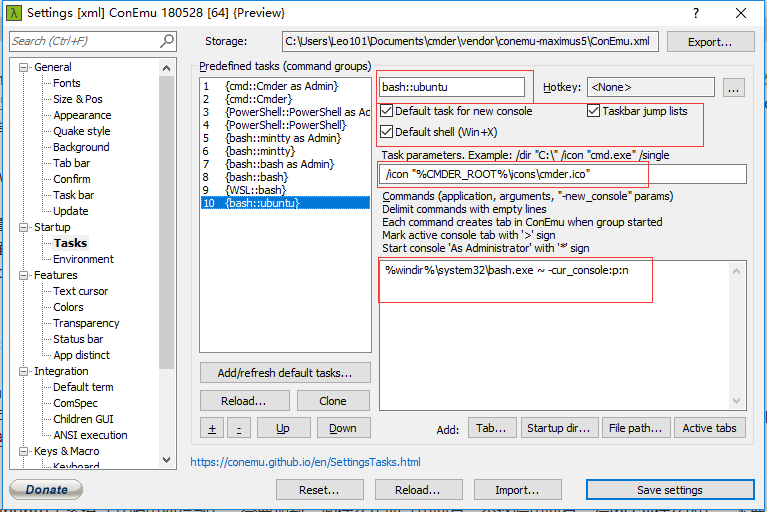
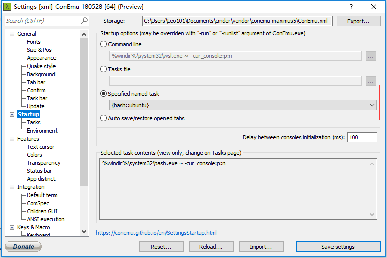

# Cmder+wsl+oh_my_zsh游玩

使用不到24小时就选择放弃，因为bug太多，并发现了一更加强大的终端，Hyper

以下为原文

---

***emmm，好东西，折腾了一个上午，终于搞好了***

---

随着对windows系统的各种需要和ubuntu系统的各种小Bug，我还是用了windows，在windows下面编程无疑是头等难题（特别是对于我这种坚决不用ide，坚决要用终端的人），然而windows的cmd和powershell简直**令人作呕**，所以我在知乎，百度，甚至Google上翻遍了后，找到了一个目前的最有解决方案，Cmder+wsl（windows subsystem for linux）+oh_my_zsh（zsh的强大不用讲了）。

首先现在windows10上安装wsl，具体方法：

1. 先到设置里->更新个安全->开发者选项，选择开发人员模式
2. 到控制面板里->卸载程序->启用或关闭windows功能，打开”适用于linux的windows子系统“
3. 到MicroSoft Store里搜ubuntu，然后有很多选项可以安装，装就是了（我比较喜欢16.04）
4. Done！

然后下载cmder

1. 先到cmder的[官网上](http://cmder.net)
2. 下载，可以选择Mini和标准版，下的有点慢，我下的是标准版，标准版上有很多实用的软件，我用的一些，所以我下的是标准版  ~~(我是不会告诉你我的网盘上有安装包的)~~  。
3. Done！

然后打开ubuntu子系统（开始里搜得到），会要加载一些什么东西（界面是一个终端里面有一行Install什么的），不要急，一般几分钟，然后要求输密码初始化之类的，Ubuntu子系统暂时就可以不管了

然后打开cmder，右边Settings，目录里有个Tasks，选择进去点加号，然后大概设置成我这样：



打红框的是需要注意的，然后再选到上面一个Startup



打红框的地方要跟我一样

然后Cmder+wsl就可以基本使用了（Vim用不了方向键），接下来就是一些小Bug（如Vim的方向键），和我的个性化设置（Oh_my_zsh），还有一些Update

---

### 1. 首先是Vim的方向键

开始用的时候很烦，因为Vim的方向键一摁就会现实E338，并退出Insertm模式，只需要再vimrc里加上一句话
```
set term=ansi
```

Done!

---

### 2.其次，就是个性化的zsh和Oh_my_zsh

这个安装步骤和Ubuntu上一样（有Ubuntu终端就是好）

```
sudo apt-get insall zsh
sh -c "$(wget https://raw.githubusercontent.com/robbyrussell/oh-my-zsh/master/tools/install.sh -O -)"
```

然后把zsh设置为默认shell，新建文件.bash_profile（在~下），里面输入：

```
exec zsh
source .zshrc
```

我比较喜欢默认oh_my_zsh，所以配置啥的没调

Done!

---

## Update

### mkdir（或其他）文件权限太高，导致ls是文件夹底色为绿色，极为难看

简单

```
chmod g-xwr Work
chmod o-xwr Work
```

如果是mkdir的话：

```
mkdir -m 700 FileName
```

---

### cmder+zsh奇慢

经过一波Baidu+Google后，确认为zsh自动检查是否为git仓库的问题，解决：

```
git config --global oh-my-zsh.hide-status 1
```

---

### Cmder因为热键冲突导致vim无法使用分屏的一些快捷键（Ctrl+w）

自己当场就解决了设置里有个按键&宏，点进去搜索Ctrl+w，改成Ctrl+Shift+w。