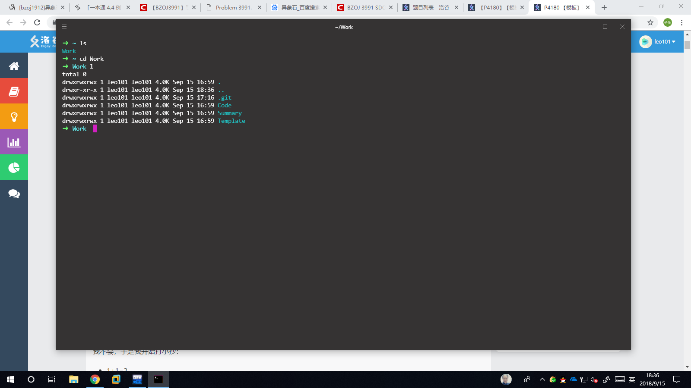

# Hyper+wsl+oh_my_zsh

---

[官网](http://hyper.is)下载，安装

配置方法官网上有

然后就是设置快捷键，小娜里搜索hyper，打开文件位置，属性，快捷方式，快捷键

Done

***简单明了的hyper***
**简直清爽无比**



---

## Update

### 如何解决文件夹权限高变绿（彻底）

修改ls显示文件夹的颜色

```
cd ~/
dircolors -p > .dircolors
```

然后修改.dircolors文件为（可以根据注释查找）

```
<略>
DIR 00;36 # director.
<略>
STICKY_OTHER_WRITABLE 00;34 # dir that is sticky and other-writable (+t,o+w)
OTHER_WRITABLE 00;36 # dir that is other-writable (o+w) and not sticky
<略>
```

然后ls文件夹就变成了传说中的蓝绿色（黑人问号），以下为颜色的背景颜色的表格

不过对于zsh还是没有用，只要把bashrc里有关ls的东西（搜索）全都复制到zshrc里就可以了

```
00 　　　 //默认
01 　　 　//加粗
04 　 　　//下划线
05 　 　　//闪烁
07 　 　　//反显
08 　 　　//隐藏
文字颜色 
30 — Black   //黑色
31 — Red     //红色
32 — Green   //绿色
33 — Yellow  //黄色
34 — Blue    //蓝色
35 — Magenta //洋红色
36 — Cyan    //蓝绿色
37 — White   //白色
背景颜色 
40 — Black 
41 — Red 
42 — Green 
43 — Yellow 
44 — Blue 
45 — Magenta 
46 — Cyan 
47 – White
```

---

## hyper中vim复制到剪切板

不能用vim-gnome了，所以Baidu了一下，在vimrc中加入

```
map <F3> : call CopyToWindows()<CR>
map! <F3> <ESC> : call CopyToWindows()<CR>
func! CopyToWindows()
    exec "w"
    exec "!cat % |/mnt/c/Windows/System32/clip.exe"
endfunc

```
F3复制