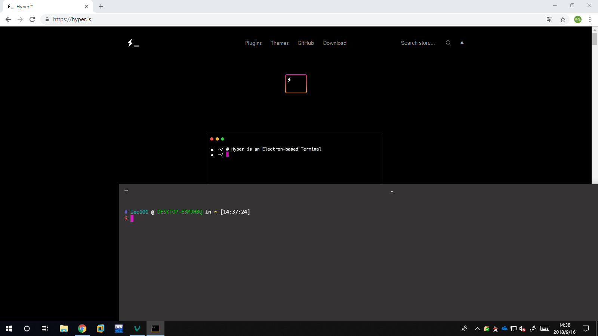

# Windows下的终极Ubuntu编程体验


**此篇汇总，其余为游玩**

我目前的最终解决方案为：wsl + hyper + oh_my_zsh，折腾了很久终于搞好了很多小Bug

首先安装wsl（Windows Subsystem for linux)，具体步骤：

1. 先到设置里->更新个安全->开发者选项，选择开发人员模式
2. 到控制面板里->卸载程序->启用或关闭windows功能，打开”适用于linux的windows子系统“
3. 到MicroSoft Store里搜ubuntu，然后有很多选项可以安装，这里一定要装Ubuntu（没有后面的版本后缀），否则有很多小问题

然后是hyper：

1. 到[官网](https://www.hyper.is/)下载Hyper，然后安装，完事

然后配置Hyper：

1. Edit->Preference
2. 把我的配置复制进去

我的配置：附件里的hyper_Preference

需要安装一个字体，Monaco，见附件

至此系统层面的已经完成，接下来为软件层面

---

安装zsh，Oh_my_zsh：

```
sudo apt-get insall zsh
sh -c "$(wget https://raw.githubusercontent.com/robbyrussell/oh-my-zsh/master/tools/install.sh -O -)"
```

选择zsh为默认shell

```
chsh -s /bin/zsh
```

解决ls文件夹变绿：

```
cd ~/
dircolors -p > .dircolors
```

然后修改.dircolors文件为（可以根据注释查找）

```
<略>
DIR 00;36 # director.
<略>
STICKY_OTHER_WRITABLE 00;34 # dir that is sticky and other-writable (+t,o+w)
OTHER_WRITABLE 00;36 # dir that is other-writable (o+w) and not sticky
<略>
```

此处为颜色的对应表

```
00 　　　 //默认
01 　　 　//加粗
04 　 　　//下划线
05 　 　　//闪烁
07 　 　　//反显
08 　 　　//隐藏
文字颜色 
30 — Black   //黑色
31 — Red     //红色
32 — Green   //绿色
33 — Yellow  //黄色
34 — Blue    //蓝色
35 — Magenta //洋红色
36 — Cyan    //蓝绿色
37 — White   //白色
背景颜色 
40 — Black 
41 — Red 
42 — Green 
43 — Yellow 
44 — Blue 
45 — Magenta 
46 — Cyan 
47 – White
```

现在在bash状态下文件颜色问题解决，但是在zsh里不行再.zshrc中加入.bashrc里有关ls的所有代码：

```
if [ -x /usr/bin/dircolors ]; then
    test -r ~/.dircolors && eval "$(dircolors -b ~/.dircolors)" || eval "$(dircolors -b)"
    alias ls='ls --color=auto'
    #alias dir='dir --color=auto'
    #alias vdir='vdir --color=auto'

    alias grep='grep --color=auto'
    alias fgrep='fgrep --color=auto'
    alias egrep='egrep --color=auto'
fi
```

问题解决

zsh速度太慢，因为Oh_my_zsh自动扫描是否为git文件夹，终端输入

```
git config --global oh-my-zsh.hide-status 1
```

对wsl更换源

```
sudo su
vim /etc/apt/sources.list
```

将里面的内容改为如下

```
deb https://mirrors.ustc.edu.cn/ubuntu/ bionic main restricted universe multiverse
# deb-src https://mirrors.ustc.edu.cn/ubuntu/ bionic main restricted universe multiverse
deb https://mirrors.ustc.edu.cn/ubuntu/ bionic-updates main restricted universe multiverse
# deb-src https://mirrors.ustc.edu.cn/ubuntu/ bionic-updates main restricted universe multiverse
deb https://mirrors.ustc.edu.cn/ubuntu/ bionic-backports main restricted universe multiverse
# deb-src https://mirrors.ustc.edu.cn/ubuntu/ bionic-backports main restricted universe multiverse
deb https://mirrors.ustc.edu.cn/ubuntu/ bionic-security main restricted universe multiverse
# deb-src https://mirrors.ustc.edu.cn/ubuntu/ bionic-security main restricted universe multiverse
deb https://mirrors.ustc.edu.cn/ubuntu/ bionic-proposed main restricted universe multiverse
# deb-src https://mirrors.ustc.edu.cn/ubuntu/ bionic-proposed main restricted universe multiverse
```

其中注释掉的为代码源，用不到

然后

```
sudo apt update 
sudo apt upgrade
```

安装c++编程环境

发现默认系统没有g++，安装

```
sudo apt install build-essential
```

---

此次，按照常理来说，系统以可以正常使用，可Bug偏偏再这个时候出现了，发现用zsh时打字光标会错位，无法正常使用，但是我发现如果把zsh主题换掉问题可以解决，但默认主题是我最喜欢的，但为了解决Bug，我还是忍痛把主题换成了ys，换主题只需要再.zshrc里修改代码就可以了。

最后上图纪念

